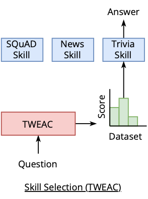
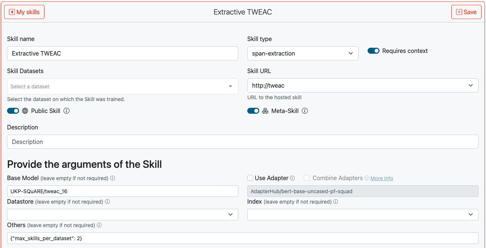
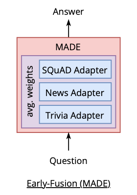
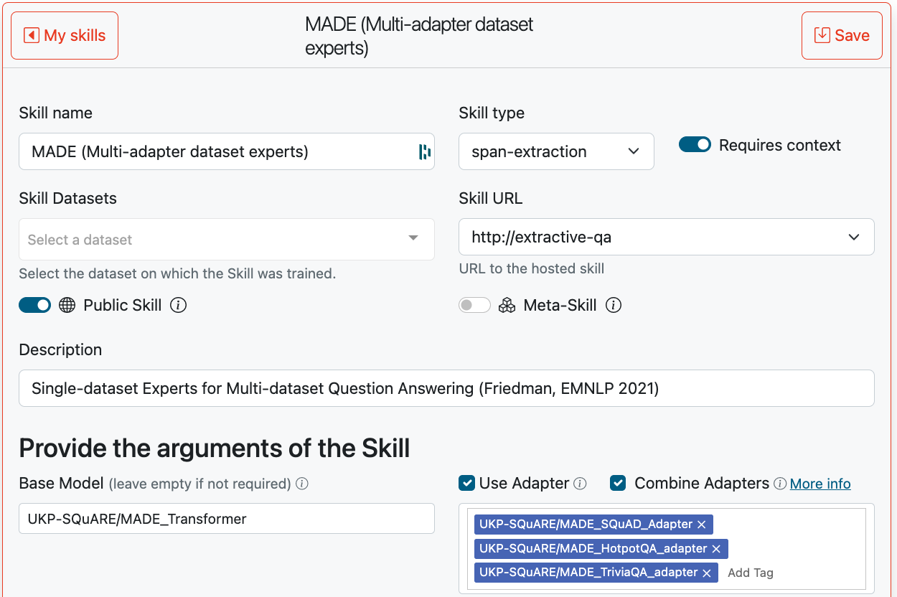
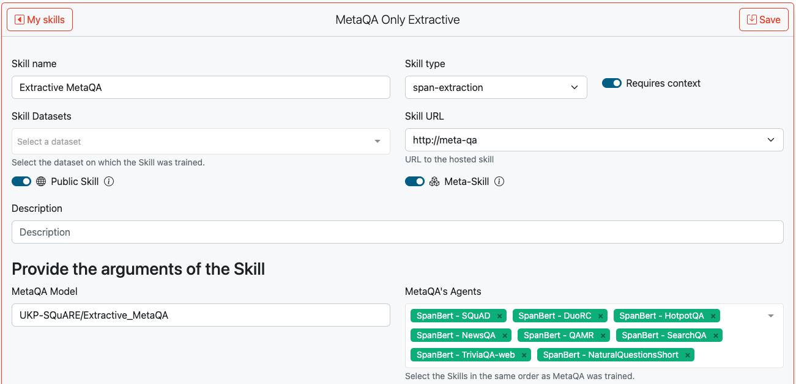

# Skills
Skills define how the user query should be processed by the Datastores and Models services and how the answers are obtained. For question answering, this might involve retrieving background knowledge from the Datastores and/or extracting spans from context using a particular Model and Adapter.

Skills can be added dynamically to UKP-SQuARE. Check out the 👉 [Add New Skills](#Add-New-Skills) for details.

For a list of available skills, see 👉 [Publicly Available Skills](#publicly-available-skills).

## Add New Skills
### The Predict Function
To create a new skill, only a predict function needs to be implemented. For facilitating this, we provide three packages: [square-datastore-client](https://github.com/UKP-SQuARE/square-datastore-client), [square-model-client](https://github.com/UKP-SQuARE/square-model-client) and [SQuARE-skill-api](https://github.com/UKP-SQuARE/square-skill-api). The client packages facilitate the interaction with other SQuARE services, such as Datastores and Models. The skill-api package wraps the final predict function creating an API that can be accessed by SQuARE. Further, it provides dataclasses (pydantic) for input and output of the predict function.

As mentioned above mainly a predict function, defining the pipeline needs to be implemented. 
First, install the required packages:
```bash
pip install square-datastore-client
pip install square-model-client
pip install square-skill-api
```
Next, we can implement the `predict` function:
```python3

# import utility classes from `square_skill_api` and `square_skill_helpers`
from square_skill_api.models import QueryOutput, QueryRequest
from square_model_client import SQuAREModelClient
from square_datastore_client import SQuAREDatastoreClient

# create instances of the SQuAREDatastoreClient and SQuAREModelClient for interacting 
# with SQuAREs Datastores and Models
square_datastore_client = SQuAREDatastoreClient()
square_model_client = SQuAREModelClient()

# this is the standard input that will be given to every predict function. 
# See the details in the `square_skill_api` package for all available inputs.
async def predict(request: QueryRequest) -> QueryOutput:

    # Call the Datastores using the `data_api` object
    data_response = square_datastore_client(datastore_name="nq", index_name="dpr", query=request.query)
    context = [d["document"]["text"] for d in data_response]
    context_score = [d["score"] for d in data_response]

    # prepare the request to the Model API. For details, see Model API docs 
    model_request = {
        "input": [[request.query, c] for c in context],
        "task_kwargs": {"topk": 1},
        "adapter_name": "qa/squad2@ukp"
    }

    # Call Model using the `model_api` object
    model_response = square_model_client(
        model_name="bert-base-uncased", 
        pipeline="question-answering", 
        model_request=model_request
    )

    # return an QueryOutput object created using the 
    # question-answering constructor
    return QueryOutput.from_question_answering(
        model_api_output=model_response,
        context=context,
        context_score=context_score
    )

```
### Adding Via Pull Request
If you want to run your Skill directly on SQuARE hardware, you can submit a [pull request](https://github.com/UKP-SQuARE/square-core/pulls) with the following changes:
1. Put your skill function in a file under: `./skills/<skill-name>/skill.py`
2. Add you skill in the [config.yaml](https://github.com/UKP-SQuARE/square-core/blob/master/config.yaml). Give the skill the same name as the folder under skills. Add your username as author.
3. Once you pull request is approved, your skill url will be `http://<skill-name>`

### Adding Self-Hosted or Cloud Skills
#### Azure Functions
1. Login to [Azure](https://portal.azure.com/)
2. Create a new function app
    - Select to publish _Code_
    - Select _Python_ as runtime stack.
3. Once the deployment is complete, under Next Steps, click _create function_ and follow the setup instructions according to your development environment.
4. During the setup:
    - Use the _HTTP Trigger_ template
    - Name the function _query_ (*This is very important, since this will determine the url under which your function will be available.*)
    - Select _anonymous_ as authorization level.
5. Develop your skill in the __init__.py
6. Add environment variables to the `local.settings.json` file under `Values`.
6. Deploy your skill according to the instructions
7. Copy the URL of your deployment and use it when creating a skill in SQuARE without the trailing `/query` (e.g. https://myskill.azurewebsites.net/api). 
An example repository can also be found at [UKP-SQuARE/cloud-example-azure](https://github.com/UKP-SQuARE/cloud-example-azure)

## Combining Skills (Meta-Skills)
SQuARE v3 provides a new key functionality to combine Skills. The current high-speed development of NLP is yielding thousands of QA models. Researches have discovered that combining them can yield to substantial gains w.r.t. models trained on multiple datasets [(Puerto et al., 2023)](https://arxiv.org/abs/2112.01922). Thus, given all the QA Skills available in SQuARE, it becomes natural to analyze the possibilities of combining them. To do this, SQuARE provides three methods: i) Automatic Skill selection, ii) Early-fusion of Skills, and iii) Late-fusion of Skills.


## Automatic Skill Selection
This approach aims to identify the Skill with the highest likelihood of returning the correct answer to the input question and then route the input to that Skill. [Geigle et al., (2021)](https://arxiv.org/abs/2104.07081) proposed TWEAC, a Transformer model with a classification head for each Skill that maps questions to Skills. The Figure below illustrates how it works.


You can create a Meta-Skill with TWEAC in the same way as any other skill but, you need to set the Skill URL to `http://tweac`. Please, also note that the flag `Meta-Skill` is on. In `base model` you will need to put a sequence-classification model, such as [UKP-SQuARE/tweac_16](https://huggingface.co/UKP-SQuARE/tweac_16), trained to identify QA datasets. This model should have a [config file](https://huggingface.co/UKP-SQuARE/tweac_16/blob/main/config.json) with the field `id2label`, where the labels are the dataset identifiers of Hugging Face. This is needed so that SQuARE is able to route your input to a Skill trained on the predicted dataset. See below an example of this `id2label` mappding:

```
"id2label": {
    "0": "boolq",
    "1": "commonsense_qa",
    "2": "drop",
    "3": "search_qa",
    "4": "squad",
    "5": "trivia_qa"
  },
```

Lastly, an important paramter to set is `max_skills_per_dataset`. It sets the number of Skills that should be called to answer your input question. For example, if TWEAC predicts the dataset `squad`, and `max_skills_per_dataset` is set to `2`. SQuARE will route your input to two Skills trained on `squad`.



### Early-fusion of Skills

You can create a Skill that combines the weights of multiple adapters as in [(Friedman et al., 2021)](https://aclanthology.org/2021.emnlp-main.495/). 


You only need to select `Use Adapter` and `Combine Adapters`. Then you can input the list of adapters you want to combine as illustrated in the Figure below.




### Late-fusion of Skills
Lastly, you can also create a Meta-Skill that combines the predictions of multiple Skills as in [(Puerto et al., 2023)](https://arxiv.org/abs/2112.01922). 


You only need to select `http://metaqa` as Skill URL, write your MetaQA model (for example [https://huggingface.co/UKP-SQuARE/Extractive_MetaQA](https://huggingface.co/UKP-SQuARE/Extractive_MetaQA)), and lastly, select the list of Skills in `MetaQA's Agents`. Please note this list is sorted. You need to select the Skills in the same order as you trained your MetaQA model. For more details on how to train MetaQA, we refer the reader to the original publication [(Puerto et al., 2023)](https://arxiv.org/abs/2112.01922). 



