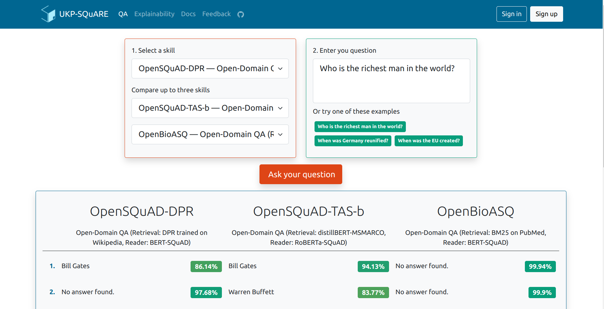
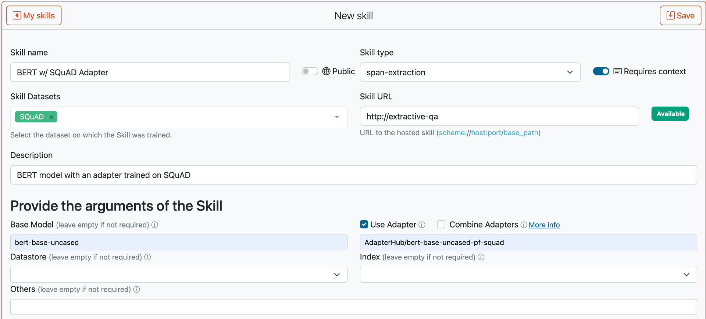
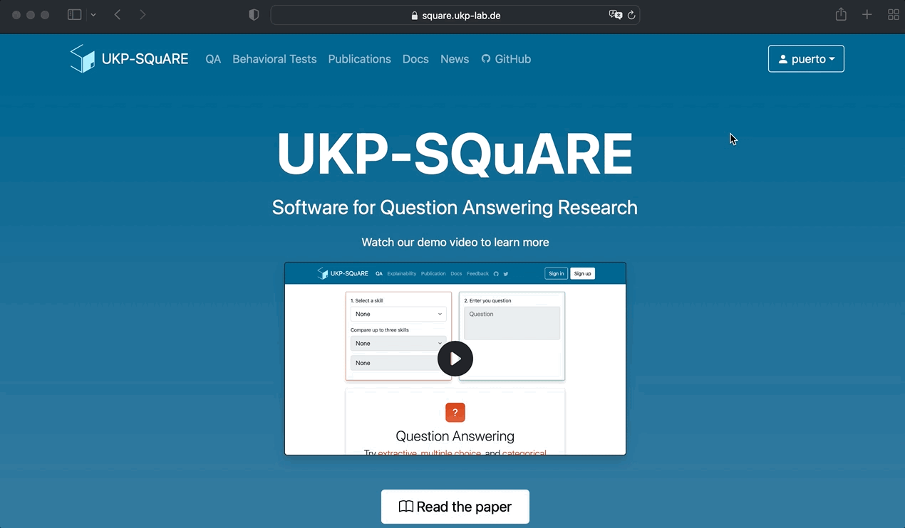

# Get Started

Try the SQuARE platform using any browswer on [https://square.ukp-lab.de/](https://square.ukp-lab.de/)! 
We already have dozens of *Skills* (#What-is-a-Skill) including span-extraction, abstractive, multi-choice QA 
with contexts or without contexts (open QA based on retrieval).



<a name="What-is-a-Skill"></a>

## What is a Skill?
A Skill is a QA pipeline. It defines a datastore, a retrieval model, a reader model, and a data preprocessing and postprocessing steps. All components are optional, allowing maximum flexibility to the user.


<a name="Add-New-Skills"></a>

## Deploying New Skills
Deploying a Skill is a simple as filling the form shown below. You just need to give a name to your Skill, select the QA format (i.e., extractive, multiple-choice, categorical/boolean, or abstractive), add some metadata such as the datasets used during training and a plain-text description, and finally specify the pipeline (i.e., the base model, the adapters (if needed), and the datastore and index (if needed)).


You can find this form after loggin in, clicking the button on the top-right with your name as shown in the GIF below. 




## Implementing a New Skill
If you want to *implement* a new Skill (i.e., create a new QA pipeline), please follow the skill package examples (e.g. [skills/local](https://github.com/UKP-SQuARE/square-core/blob/master/skills/local/skill.py)) and submit yours via a [pull request](https://github.com/UKP-SQuARE/square-core/pulls). We will make it run after code review.

You can also host the Skill yourself in a cloud environment outside of SQuARE. In this case, you would only need to provide the URL to your running Skill when deploying the Skill. 


## Citation

If you find this repository helpful, feel free to cite our publications:

- ACL 2022 [UKP-SQUARE: An Online Platform for Question Answering Research](https://aclanthology.org/2022.acl-demo.2/):
```
@inproceedings{baumgartner-etal-2022-ukp,
    title = "{UKP}-{SQ}u{ARE}: An Online Platform for Question Answering Research",
    author = {Baumg{\"a}rtner, Tim  and
      Wang, Kexin  and
      Sachdeva, Rachneet  and
      Geigle, Gregor  and
      Eichler, Max  and
      Poth, Clifton  and
      Sterz, Hannah  and
      Puerto, Haritz  and
      Ribeiro, Leonardo F. R.  and
      Pfeiffer, Jonas  and
      Reimers, Nils  and
      {\c{S}}ahin, G{\"o}zde  and
      Gurevych, Iryna},
    booktitle = "Proceedings of the 60th Annual Meeting of the Association for Computational Linguistics: System Demonstrations",
    month = may,
    year = "2022",
    address = "Dublin, Ireland",
    publisher = "Association for Computational Linguistics",
    url = "https://aclanthology.org/2022.acl-demo.2",
    doi = "10.18653/v1/2022.acl-demo.2",
    pages = "9--22",
}
```
- AACL 2022 [UKP-SQUARE v2: Explainability and Adversarial Attacks for Trustworthy QA](https://aclanthology.org/2022.aacl-demo.4/):
```
@inproceedings{sachdeva-etal-2022-ukp,
    title = "{UKP}-{SQ}u{ARE} v2: Explainability and Adversarial Attacks for Trustworthy {QA}",
    author = {Sachdeva, Rachneet  and
      Puerto, Haritz  and
      Baumg{\"a}rtner, Tim  and
      Tariverdian, Sewin  and
      Zhang, Hao  and
      Wang, Kexin  and
      Saadi, Hossain Shaikh  and
      Ribeiro, Leonardo F. R.  and
      Gurevych, Iryna},
    booktitle = "Proceedings of the 2nd Conference of the Asia-Pacific Chapter of the Association for Computational Linguistics and the 12th International Joint Conference on Natural Language Processing: System Demonstrations",
    month = nov,
    year = "2022",
    address = "Taipei, Taiwan",
    publisher = "Association for Computational Linguistics",
    url = "https://aclanthology.org/2022.aacl-demo.4",
    pages = "28--38",
}
```
